# Class diagram

The ten classes that make up Castle Adventure, and how they relate.

```mermaid
classDiagram
    direction TB

    class Game {
        -Player _player
        -Castle _castle
        -GameState _state
        -bool _in_combat
        -float _deadline
        -list~str~ _log
        -int _rooms_visited
        -int _enemies_defeated
        +__init__(castle)
        +new_game()$ Game
        +player() Player
        +castle() Castle
        +state() GameState
        +in_combat() bool
        +log() list~str~
        +rooms_visited() int
        +discovered_count() int
        +walls_found() int
        +enemies_defeated() int
        +current_room() Room
        +can_move() bool
        +time_remaining() float
        +move_to(room_id) str
        +submit_answer(answer) str
        +register_timeout() str
        -_bump_into_wall(wall) str
        -_resolve_room() str
        -_start_combat(enemy) str
        -_defeat_enemy(enemy) str
        -_check_victory() void
        -_log_message(message) void
    }

    class GameState {
        <<enumeration>>
        PLAYING
        VICTORY
        DEFEAT
    }

    class Player {
        -str _name
        -int _health
        -int _gold
        -int _position
        +__init__(name)
        +name() str
        +health() int
        +gold() int
        +position() int
        +take_damage(amount) void
        +gain_gold(amount) void
        +move_to(room_id) void
        +is_alive() bool
        +has_enough_gold() bool
    }

    class Castle {
        -int _rows
        -int _columns
        -dict _rooms
        +__init__(rows, columns)
        +rows() int
        +columns() int
        +room_count() int
        +walkable_room_count() int
        +rooms() list~Room~
        +room_ids() list~int~
        +generate_random()$ Castle
        +id_at(row, column) int
        +get_room(room_id) Room
        +has_room(room_id) bool
        +neighbours_of(room_id) list~int~
        +is_side_by_side(room_id, other_id) bool
        +walls() list~int~
        +visited_count_from(start_id) int
        -_choose_walls() int
        -_every_wall_can_be_bumped() bool
        -_walkable_area_is_connected() bool
        -_build_maze() void
        -_unvisited_neighbours(room_id, visited) list~int~
        -_deal_contents() void
        -_empty_the_starting_room() void
    }

    class Room {
        -int _id
        -int _row
        -int _column
        -RoomType _type
        -list~int~ _connections
        -Treasure _treasure
        -Enemy _enemy
        -bool _discovered
        +__init__(room_id, row, column)
        +room_id() int
        +row() int
        +column() int
        +type() RoomType
        +treasure() Treasure
        +enemy() Enemy
        +icon() str
        +has_treasure() bool
        +has_live_enemy() bool
        +place_treasure() void
        +place_enemy() void
        +place_wall() void
        +place_empty() void
        +is_wall() bool
        +remove_treasure() void
        +remove_enemy() void
        +swap_contents_with(other) void
        +connect_to(other_id) void
        +is_adjacent_to(other_id) bool
        +is_side_by_side(other) bool
        +connections() list~int~
        +discovered() bool
        +discover() void
        -_refresh_type() void
    }

    class RoomType {
        <<enumeration>>
        EMPTY
        TREASURE
        ENEMY
        WALL
    }

    class Treasure {
        -int _gold
        +__init__(gold)
        +create_random()$ Treasure
        +amount() int
    }

    class Enemy {
        -str _name
        -int _damage
        -bool _is_defeated
        -MathOperation _question
        +__init__(name, damage)
        +create_random()$ Enemy
        +name() str
        +damage() int
        +question() MathOperation
        +pose_question() MathOperation
        +defeat() void
        +is_defeated() bool
    }

    class MathOperation {
        -int _first
        -int _second
        -str _operator
        -int _result
        +__init__(first, second, operator, result)
        +create_random()$ MathOperation
        +text() str
        +is_correct(answer) bool
    }

    class Config {
        <<namespace>>
        STARTING_HEALTH = 20
        ENEMY_DAMAGE = 5
        GOLD_PER_ENEMY = 10
        GOLD_GOAL = 60
        TREASURE_GOLD_MIN = 20
        TREASURE_GOLD_MAX = 40
        MAP_ROWS = 4
        MAP_COLUMNS = 4
        TREASURE_ROOMS = 4
        ENEMY_ROOMS = 3
        WALL_ROOMS = 3
        STARTING_ROOM = 0
        ANSWER_TIME_LIMIT = 20
        TIMER_REFRESH_SECONDS = 0.5
    }

    Game "1" *-- "1" Player : _player
    Game "1" *-- "1" Castle : _castle
    Game --> "1" GameState : _state
    Castle "1" *-- "0..16" Room : _rooms
    Room --> "1" RoomType : _type
    Room o-- "0..1" Treasure : _treasure
    Room o-- "0..1" Enemy : _enemy
    Room --> "0..4" Room : _connections (ids)
    Enemy "1" *-- "0..1" MathOperation : _question
    Player ..> Config
    Castle ..> Config
    Room ..> Config
    Enemy ..> Config
    Treasure ..> Config
    MathOperation ..> Config
```

A `$` after a method name marks it as a **static method**. Those are the
five factories: `Game.new_game()`, `Castle.generate_random()`,
`Enemy.create_random()`, `Treasure.create_random()` and
`MathOperation.create_random()`.

The same diagram in PlantUML is in
[class-diagram.puml](class-diagram.puml), for rendering as an image.

## Design notes

### Two kinds of "next door"

`Room` answers two different questions about a neighbour, and keeping them
apart is what makes walls work at all:

| Method | Question | Used by |
| --- | --- | --- |
| `is_adjacent_to(id)` | is there a **passage** there? | the player walks in |
| `is_side_by_side(room)` | do the cells merely **touch**? | the player may try, and finds a wall |

`is_side_by_side` takes a `Room`, not an id, because turning a room id back
into a `(row, column)` pair needs to know how many columns the grid has.
Only `Castle.is_side_by_side(a, b)` can do that, so it resolves both ids and
delegates.

Folding the two methods together would quietly turn every plain castle wall
into a room the player could walk into.

### Walls sit outside the tree

A wall holds no passages at all, so the maze is a tree over the **walkable**
rooms only: `walkable_room_count - 1` passages, and
`visited_count_from(start) == walkable_room_count`. Walls are therefore
*not* reachable by walking — they are found by bumping, which is why
`Game._bump_into_wall()` is its own method and not a branch of `move_to()`.

Because walls are raised **before** the depth-first search runs, the search
simply never considers them. Raising them afterwards and then deleting the
passages would also work, but it would mean building passages and then
tearing them out.

### Placing a wall can break the castle, so each one is checked

A line of walls can split a 4x4 grid in two, and the search only reaches the
piece holding the starting room. A treasure in the other piece makes the run
unwinnable — measured over random castles, that broke **15% of them**. So
`_choose_walls()` raises one wall at a time and asks two questions before
keeping it:

- `_walkable_area_is_connected()` — no room is stranded;
- `_every_wall_can_be_bumped()` — no wall is ringed by other walls, which
  would make it content the player can never reach.

A candidate that fails either is reverted with `place_empty()` and the next
one is tried. `place_wall()` / `place_empty()` exist as a matched pair
purely so that revert is a real operation rather than poking at `_type`.

### `RoomType.WALL` is not "empty"

`EMPTY` means "walkable, nothing here". `WALL` means "solid stone here":
never walkable, never holds treasure or an enemy, excluded from the maze.
That is why `_refresh_type()` returns early on a wall — a wall is not a
container, so recomputing its type from its contents would be meaningless
and would quietly turn it back into an empty room on the next swap.

### Fog of war lives on the room

`Room._discovered` starts `False` and only `Game` ever calls `discover()`.
Storing it on the room rather than in a set inside `Game` means `Room.icon`
can answer "what should the map draw?" on its own, with no knowledge of the
player, and the fog cannot be bypassed by forgetting to check a global.

The check is the **first** thing `icon` does, before the treasure and enemy
branches. Anything else would let an unexplored room leak what it holds.

### Links are stored as ids, not as objects

`Room._connections` is a list of `int`, and so is `Player._position`.
That is why `Room --> Room` is drawn as a plain association: the castle
never keeps a reference to another room, only to its number. The upside
is that there are no reference cycles, so the objects cannot leak into
each other and nothing can recurse forever by accident.

### `Treasure` and `Enemy` are optional parts

Both are attached to a room with an **optional** aggregation (`o--`,
`0..1`). When `remove_treasure()` or `remove_enemy()` runs, the room goes
back to `RoomType.EMPTY`, which is why `_refresh_type()` recomputes the
type from whatever the room currently holds. This is the rule that keeps
the map honest: a room you have already solved shows as `EMPTY`, never as
a solved treasure or a defeated enemy.### Only `Game` is allowed to change health or gold

`Player` has `take_damage()` and `gain_gold()`, but no other class calls
them. `Game` is the referee, so there is exactly one place to look when
asking "what happens if I walk into an enemy room?". A rule enforced in
one place is a rule that cannot be bypassed.

### The factory methods compute the hard parts

`MathOperation.create_random()` is where the answer is calculated, and
it also swaps the operands when a subtraction would go negative. The
`__init__` just stores what it is given. The same pattern applies to
`Enemy.create_random()` and `Treasure.create_random()`, which pull from
`Config` so the random values always respect the game's limits.

## Keeping this up to date

This diagram was checked against the actual source by reading every
class with Python's `ast` module, so it matches the code rather than
what the code was meant to be.

If you add or rename a method, update this file too. A quick check is to
compare the classes here against the files in `models/` and `game.py`.
